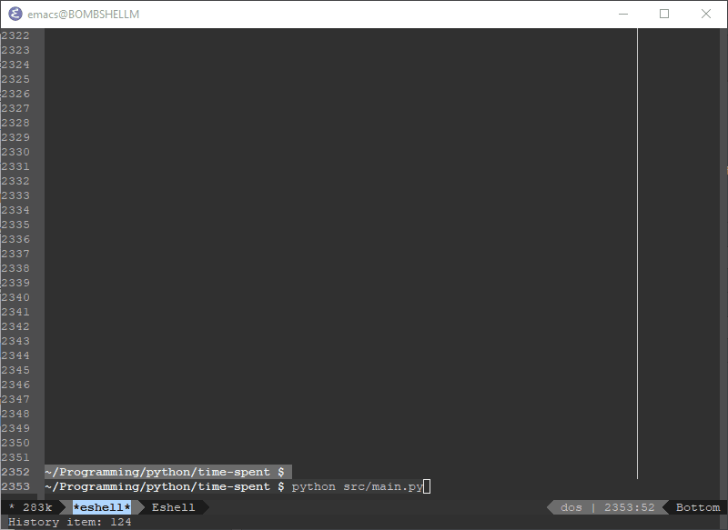

# Time Spent

A personal program written to keep track of where I spend my time. Also used as
an introduction into unit testing in Python.

Project was mostly created specifically so that my data on projects can be stored
in a universal format (UNIX timestamps).

To run the program simply run:

```sh
python src/main.py
```

Then you have four commands:

- `start` : which starts the timer for your project.
- `end` : which ends the time for your project and asks you for the project name.
- `pretty` : which displays a pretty table for one of your projects with infomation on work time.
- `quit`



